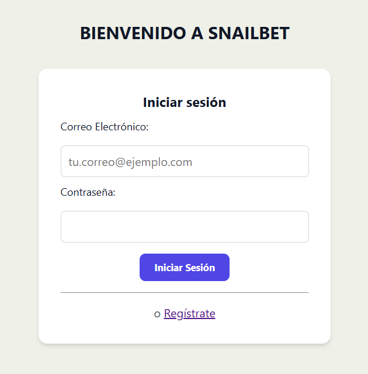
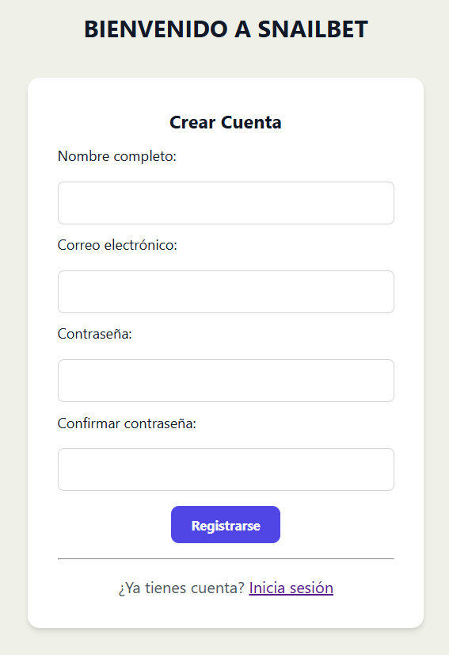
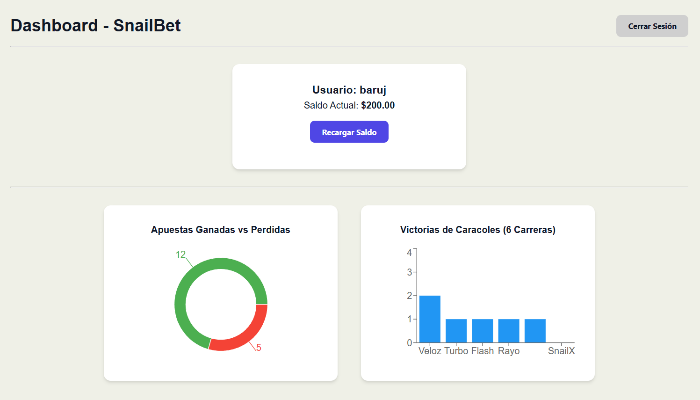

# 🐌 SnailBet

Aplicación web **Full-Stack** desarrollada con React, TypeScript y Express que simula una plataforma de apuestas sobre carreras de caracoles.

El proyecto fue desarrollado como ejercicio técnico, poniendo especial atención en la separación de responsabilidades, validación de datos, persistencia de sesión y saldo mediante `LocalStorage`, manejo de errores y pruebas automatizadas.

---

## 🚀 Tecnologías

### Frontend

* React
* TypeScript
* React Router
* Vite
* CSS
* LocalStorage
* Vitest
* React Testing Library

### Backend

* Node.js
* Express
* TypeScript
* CORS
* Vitest

---

## ✨ Funcionalidades

### 🔐 Autenticación

* Registro de nuevos usuarios.
* Validación de campos obligatorios.
* Validación de contraseña mínima de 6 caracteres.
* Confirmación de contraseña.
* Validación de correo previamente registrado.
* Inicio de sesión.
* Cierre de sesión.
* Persistencia de sesión mediante `LocalStorage`.
* Protección de las funcionalidades posteriores al inicio de sesión.

## 🧪 Pruebas

Se implementaron pruebas automatizadas utilizando **Vitest**.

### Backend

Se probaron los principales escenarios de SnailPay:

* ✅ Pago exitoso.
* ✅ Tarjeta rechazada.
* ✅ Error interno de SnailPay.

Ejecutar:

### Frontend

Se implementaron pruebas para el flujo de registro, incluyendo:

* ✅ Campos obligatorios.
* ✅ Contraseñas que no coinciden.
* ✅ Contraseña menor a 6 caracteres.
* ✅ Correo previamente registrado.
* ✅ Registro exitoso.

## ⚙️ Instalación

### Requisitos

* Node.js
* npm

### 1. Clonar el repositorio

```
git clone <REPOSITORY_URL>
```

### 2. Instalar dependencias del frontend

```
cd frontend
npm install
```

### 3. Instalar dependencias del backend

En otra terminal:

```
cd backend
npm install
```

---

## ▶️ Ejecutar el proyecto

### Backend

Desde `backend`:

```
npm run dev
```

El servidor estará disponible en:

```
http://localhost:3000
```

### Frontend

Desde `frontend`:

```
npm run dev
```

Vite mostrará la dirección local para acceder a la aplicación.

---

## ▶️  Proyecto

###Login

###Register

###Dashboard


---

## 👨‍💻 Autor

**Fernando Haro**

Proyecto desarrollado con fines de demostración técnica y aprendizaje Full-Stack.
